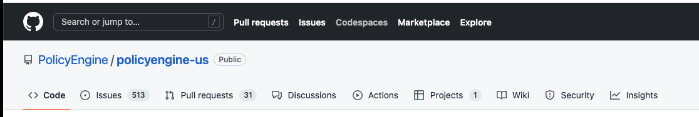
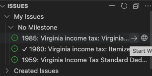
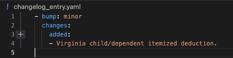
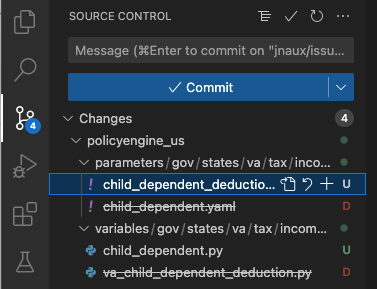

# PolicyEngine US

PolicyEngine US is a microsimulation model of the US state and federal tax and benefit system.

To install, run `pip install policyengine-us`.

## START

### When starting to work on a specific policy program
- First check the legal code of the program
 - Model based on legal code structure
- Second check newest tax form for inflation adjusted amount confirmation
### Setting up your enviorment

#### Contribution on codespaces
- Steps:
1. If you haven't already, fork the PolicyEngine/policyengine-us repo to your personal account
   Leave the Copy the master branch only box checked
2. From GitHub Codespaces, click New codespace
3. Select yourusername/policyengine-us as the repository and all other defaults
4. Create new codespace from blank template
5. conda create -n policyengine python=3.10 -y
6. conda init
7. Restart terminal (bin and create new one)
8. Run conda activate policyengine
9. Type in terminal: make install
10. Check out the issue you want to work on
    If no issue, create one at github.com/policyengine/policyengine-us, or from the GitHub extension in Codespaces
11. After making changes, test with make test
    This sometimes fails with [Makefile:9: test] Killed after a while
    To run a specific test or folder of tests, run policyengine-core test [path]
    Optionally with -v to get verbose output (the computation tree)

- When returning to the codespace:
1. Return to GitHub Codespaces
2. Open the codespace you previously made
3. Open terminal
4. conda activate policyengine
   If this fails, that means your codespaces session has expired. Re-run steps 5-7.
5. After coding, add the changelog_entry.yaml
6. make format
7. For the problem of Check version: git pull upstream master

#### Contributing on VScode
1. Install VS Code
2. Install VS Code extensions (you'll have to sign in to GitHub for each)
   a. GitHub Pull Requests & Issues extension
   b. Live Share Install
   c. Python extension
   d. Recommended: GitHub Copilot https://github.com/features/copilot (free 30 day trial but you'll want it forever)
3. Set git username and email
   a. git config --global user.name "John Doe"
   b. git config --global user.email johndoe@example.com
4. Install conda
   python3 get-pip.py
5. Fork and clone country package you're working on:
  github.com/policyengine/policyengine-us 
  github.com/policyengine/policyengine-canada
  Forkzsh: command not found: brew
  github.com/policyengine/policyengine-ng
6. Extras for Windows
   a. Install make
      - Open VS Code as administrator (search and right-click)
      - Open a new terminal in VS Code
      - https://chocolatey.org/install
      - Copy the command into the terminal
      - choco install make
   b. Run conda https://stackoverflow.com/a/67996662/1840471
7. Run make install from terminal in VS Code after opening policyengine-us
   a. If you have multiple versions of Python installed, you may need to run
      python3 -m pip install -e .
8. Change format on save for Python to black and set line length to 79

Without conda:
Mac:
  Install brew
  brew install python
  pyenv init
  pyenv shell 3.10
  python -m venv venv

### Creating a new issue

- Go to the ‘Issues’ tab
- Click on ‘New Issue’
- Can assign to specific person/people
- Remember to add tags for better classification

### Creating a pull request

https://policyengine.github.io/policyengine-core/intro.html

1. Identify an issue. If you want to work on a task that's not yet an issue, create an issue for it. Issues should specify the program rule and link to a law and/or government site (e.g. tax form).
2. Claim the issue. In VS Code, open the GitHub extension, find the issue, and click the right arrow. This will assign you to the issue and create a new branch named for the issue numbe
3. Create a unit test. This will be a file in policyengine_{country}/tests/[path to program]/variable.yaml. We apply test driven development, where we write tests before writing the logic; this means tests will break, and the goal of the PR is to pass the tests. Unit tests specify direct inputs to the variable for a number of cases, and the expected output. See x as an example.
4. Commit your changes. Use the VS Code source control extension to enter a message, such as "Create unit test for [variable]" and commit.
5. Populate changelog_entry.yaml. This describes the changes.
6. Commit your changes again. Enter the commit message, "Populate changelog_entry.yaml".
7. Publish branch. Publish to origin (your fork).
8. Draft a pull request (PR). VS Code will ask if you want to create a pull request. Click the button to do so. Enter a title describing what the completed PR will contribute, like "Add [variable or program]". Add to the body "Fixes #[issue]" to link the PR to the issue, such that merging the PR will close the issue. Check the box for "Draft" indicating that the PR is not yet ready to merge.
9. Run make test from the terminal. The new tests will fail, but after successfully completing the remaining steps, they will pass.
10. Create the policy parameters. Parameters are features of the rules defined in the law; they can be numbers, bools, or lists, and they can also break down by categories or vary with respect to quantitative variables (scale parameters). PolicyEngine defines 
parameters as yaml files, which specify the values as of certain dates, as well as metadata on the units and reference(s).
11. Create the variable logic. Variables are features of each person or household, and PolicyEngine defines them as Python files. Create a file in the variables tree corresponding to the program, such as "my_tax_credit.py" and copy an existing .py file as a template. Variables are instances of the Variable class, which defines attributes like the entity and reference, and a formula method defining the logic.
12. Run make test again. To run a specific yaml test or folder of yaml tests, run policyengine-core test [path] -c policyengine_canada.
13. Run make format. This will align the code to the black Python formatting standard, and ensure each file ends in an empty new line.

### Working on issues assigned in VS Code

- Create a new working branch for the specific issue you are working on: you can do so by clicking the right arrow → (you don’t want to be working on the master branch)

- There are four specific files you will need to work on for an issue:
 - Test (.yaml)
 - Parameter (.yaml)
 - Variable (.py)
 - Changelog (.yaml)

(Note: Test and Variable files should have the same name)
- Type make format in terminal
- Commit the changes you’ve made (under the Source Control menu)
 - Enter Message before commiting
 

- Type git pull upstream master in the terminal to make sure you are using the latest version of the repository; you will need to do this before every sync or pull request (but never do this before you commit)
- Create pull request
 - Title: [Specific changes you’ve made for this pull request, e.g. ‘Add Virginia Personal Exemption’]
 - Description: be sure to include ‘Fixes #[issue number]’ to link the pull request to the specific issue you are tackling
 - Make sure you select the checkbox to create a draft pull request for
review/merge

### Troubleshooting
- After you submit your pull request, you can go to the github.com to see if it has passed all the tests
 - Lint error: usually can be resolved by typing ‘make format’ in the terminal 
- Other common issues:
 -  If making a parameter broken down by filing status, make sure you include all five parameters in your parameter file:
    - SINGLE
    - SEPARATE
    - WIDOW
    - HEAD_OF_HOUSEHOLD 
    - JOINT

(Sometimes, the tax instruction does not specify all five filing statuses. In that case, you can let the ‘WIDOW’ and the ‘HEAD_OF_HOUSEHOLD’ cases be the same as the ‘SINGLE’ case.)
 - When you are trying to define a condition, use the where statement instead of an if statement. Similarly, use max_ and min_ instead of max and min. These are needed for vectorization.
- Some useful commands:
 - condainit
 - gitconfig–globalpull.rebasefalse
  - If you have a merge issue and it asks which you want to do 
  - gitpull
- gitcommit-am'resolve'
- gitreset–hardHEAD
- rm-ft
